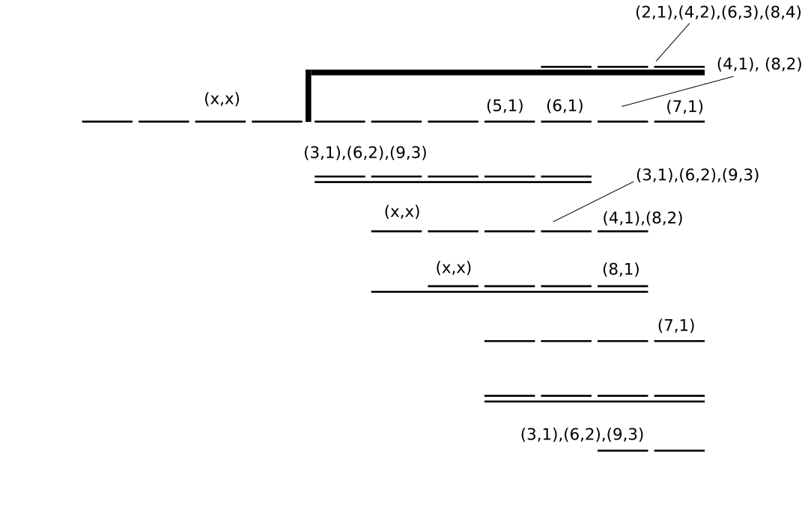

# A computational solution to Jane Street Puzzle of July 2017

The puzzle is <https://www.janestreet.com/puzzles/split-division/>.

Naive solution would be to bruteforce through all 11 digits (divisor and dividend). In this case, we have 81e9 combinations. Then we would need to check all pairs of division problems (digit-wise divide and compare) which gives us about 1e19 combinations. Assuming 1 nanosecond per combination, it will take about 300 years to check all pairs.

We can drastically reduce search space by excluding impossible digits.


This can be bruteforced.


Compile with:
```{.shell}
ghc -O3 -threaded -dynamic div.hs
```

Run four threads with:  
```{.shell}
./div +RTS -N4 > jsc_jul_resFILTERED.txt
```

`jsc_jul_resFILTERED.txt` contains the solution.
